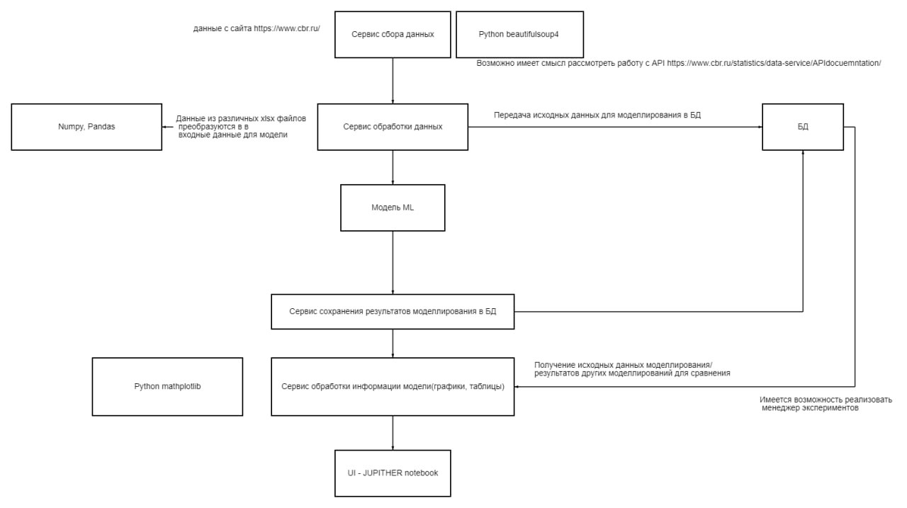

# WIKI
TEST
### Доска с задачами
https://ru.yougile.com/team/7063d1c5dafa

### Архитектура проекта

# Структура проекта
## data_transform
Файлы для обработки данных
 - Создание pandas dataframe из XLSX
 - Первичная обработка данных перед отправкой в БД

## db

Файлы для взаимодействия с БД
 - Отправка pandas dataframe в БД
 - Получение dataframe из БД
 - SQL Запросы для преобразования данных

## parser
Файлы для получения данных с сайта https://www.cbr.ru/

## model
Сервис модели

